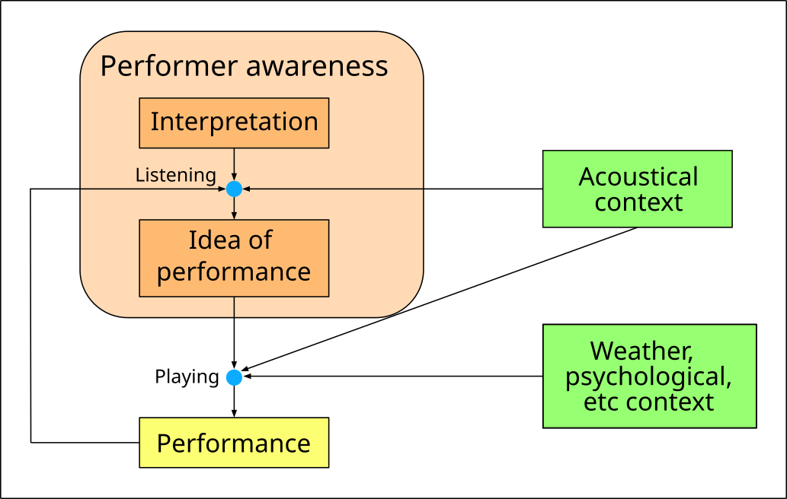

This website is the home for various scientific efforts directed towards the
analysis of music interpretation.

In Music Information Processing field, the _interpretation_ of a music piece
has been defined as the artistic intention of the performer. It must be
distinguished from the _performance_.

It must be remarked that the use of such terminology does not depend on the
musicological debate about how and when the concept of interpretation was born,
but it has the sole scope of distinguishing the interior and ideal
representation of the performance, from the real performance that was actually
realized.

Starting from 1928, various studies have analyzed how musicians adapt their way
of playing to the surrounding acoustical context (see [References](#references)
below).

More in general, in order to better define the phenomenon of interpretation
adaptation, we also postulate the existence of unknown factors that can induce
an unconscious adaptation of the interpretation. Such factors could include,
for instance, the psycho-physiological conditions of the performer or weather
conditions such as humidity and temperature that can affect the acoustic
properties of the instrument. It is important to observe that such unknown
factors are included in the proposed framework to achieve a more complete
description of the phenomenon, but no experimental proof of their actual
relevance is known to the authors as of the time of writing.

The following scheme, derived from [Ueno et al., 2010], resumes the proposed
distinction between interpretation and performance.

## Publications

A number of publications were born around Music Interpretation Analysis:

1. F. Simonetta, F. Avanzini, and S. Ntalampiras, “A Perceptual Measure for Evaluating the Resynthesis of Automatic Music Transcriptions,” Multimedia Tools and Applications, 2022, [link](https://arxiv.org/abs/2202.12257).
2. F. Simonetta, S. Ntalampiras, and F. Avanzini “Context-aware Automatic Music Transcription,” EUSIPCO, 2022, submitted, [link]().
3. F. Simonetta, “MIA: Music Interpretation Analysis,” PhD. Thesis, 2022, [link]().

## References

